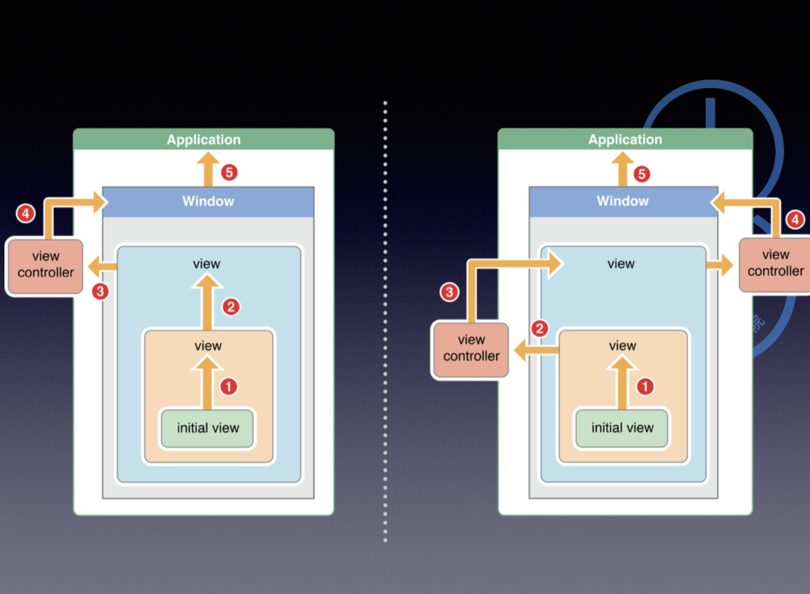

App 比喻为一个人，事件就相当于人的神经系统。

iOS 事件： 1.运动事件（摇晃、计步器等） 2.远程控制事件（耳机控制、蓝牙等） 3.触摸事件

// 作业：
    1.微博底部中间点击
    2.button点击背后的发生的事件。

一. 事件传递

        1、理解这个流程
        2、修改pointInside和HitTest看影响  pointInside和HitTest方法作用：(寻找处理事件的View对象)
        3、影响Hit-Test流程的因素alpha、hidden、userInteractionEnabled
        4、自己模拟系统的Hit-Test流程

        app需要响应动态的事件，比如在有多个对象的屏幕内有一个触摸事件发生，这是时候你需要决定哪个对象来响应事件。
        当用户产生一个触摸事件，UIKit会生成一个event object包含了该事件需要处理的信息（时间、位置、状态等），然后把该event object放在app的事件队列里（先进先出），（触摸事件它是一个NSSet型的touches。对于motion事件（加速计等），event取决于是哪种motion event） 事件沿着一个特定的路径来传递到可处理事件的对象上来，首先UIApplication从事件队列里拿到一个event进行分发，传给keyWindow，再传给initial object（取决于事件的type）。

1、touch事件：keywindow传递事件给事件发生的view（通过hitTest方法来递归找到）
2、motion和远程控制事件

二. 事件响应

         1、事件响应流程
         2、UIResponder和响应链的组成
         

三. 手势种类和手势与内部的touch:方法的关系

        手势种类：
        UITapGestureRecognizer
        UIPanGestureRecognizer   (拖动)
        UISwipeGestureRecognizer (轻扫)
        UIPinchGestureRecognizer (捏合)
        UIRotationGestureRecognizer  (旋转)
        UILongPressGestureRecognizer (长按)
        UIScreenEdgePanGestureRecognizer (屏幕边缘)
        
        手势与内部的touch:方法的关系：
        手势的种类是根据手势内部的touch:方法判断的。
        
四.手势和hitTest、pointInside的关系

        必须先通过两个函数找到处理事件的View,然后View上添加的手势才能响应。
        View 以及 View.superview... 上如果有手势都会响应。

五.UIView的外部手势和UIView的内部 touches:方法的关系

        ges.cancelsTouchesInView = YES; // 识别手势之后，是否取消View内部的touch事件。实际效果没有演示出来
        ges.delaysTouchesBegan = YES;   // 是否延迟View的touch事件识别。如果延迟了，那么手势也识别了，就放弃touch事件。
